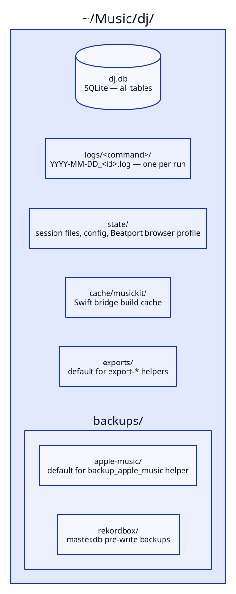
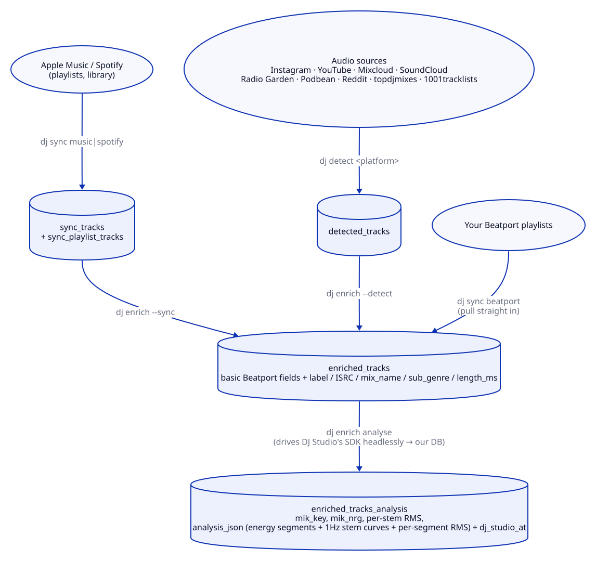
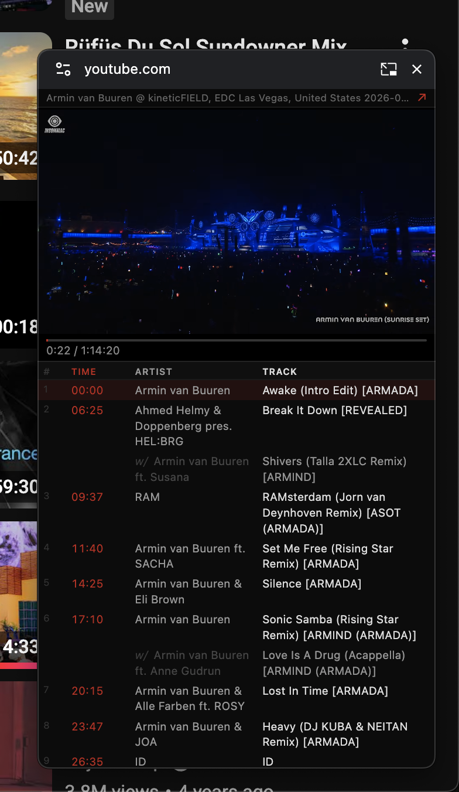
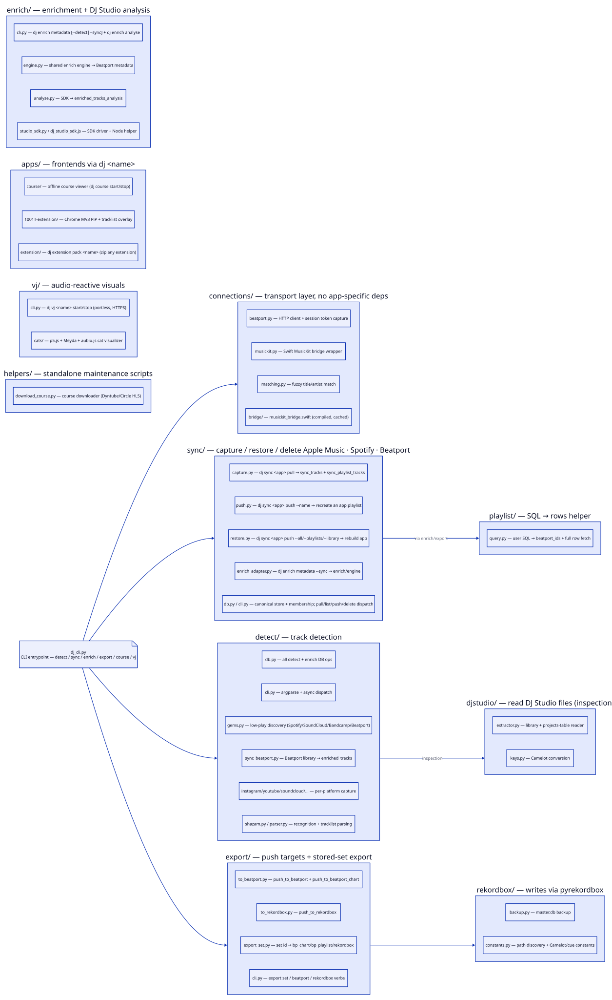

# dj

Unified DJ toolkit. Builds a fully-analysed track library: pull tracks in from Apple Music, Beatport, and detected audio sources, progressively enrich each track with Beatport metadata and DJ Studio analysis (key/energy/cues/stems). Then build energy-sequenced sets, and push any stored set or SQL-curated subset to a Beatport chart/playlist or a rekordbox playlist.

## Tour

<video src="https://github.com/baymac/dj/raw/baymac/dj-cli-demo-hyperframes/docs/promo/dj-demo/renders/dj-demo.mp4" poster="docs/promo/dj-demo/poster.png" controls width="100%"></video>

All tool-generated files live under `~/Music/dj/`:



<!-- Diagram source: docs/diagrams/storage-layout.d2 — edit that and re-run scripts/build-diagrams.sh -->


## Setup

### Install (recommended)

```bash
# One-line installer — resolves the latest release tag automatically.
curl -fsSL https://raw.githubusercontent.com/baymac/dj/main/install.sh | bash

# Or install a specific version:
uv tool install git+https://github.com/baymac/dj.git@v0.1.6.3
```

Requires **macOS** and [uv](https://astral.sh/uv/install.sh). After install, `dj` is on your PATH globally — no virtualenv activation needed.

### Contributor (source checkout)

```bash
git clone git@github.com:baymac/dj.git && cd dj
uv sync
source .venv/bin/activate            # puts `dj` on your PATH
uv run playwright install chromium   # needed for SoundCloud browser fetch
```

In a source checkout, every command can be run as `uv run dj_cli.py <command>` (the form used in examples below) or just `dj <command>` once the venv is active. An installed copy always uses `dj <command>`.

### Prerequisites

| Prerequisite | Required for | Install |
|---|---|---|
| macOS | everything | — |
| [uv](https://astral.sh/uv/install.sh) | install / update | `curl -LsSf https://astral.sh/uv/install.sh \| sh` |
| Node.js v18+ / npm / npx | `dj course`, `dj vj` | [nodejs.org](https://nodejs.org) or `brew install node` |
| Xcode Command Line Tools (`swiftc`) | `dj sync music` | `xcode-select --install` |
| [DJ Studio](https://dj.studio) | `dj enrich analyse` | Install the app |
| Playwright Chromium | `dj detect` (audio sources) | `uv run playwright install chromium` |

**Run `dj doctor`** to verify every prerequisite and `.env` value. It prints the exact fix-it command for anything missing — run it first if a command misbehaves.

### Credentials (.env)

Create `~/Music/dj/.env` with your Beatport session token:

```
BEATPORT_SESSION_TOKEN=<your-token>
```

To get the token: sign in at beatport.com → DevTools → Application → Cookies → copy `__Secure-next-auth.session-token`.

That single token is enough to start. See [Beatport auth](#beatport-auth) for how refresh works and [Environment variables](#environment-variables) for the full list of optional per-source credentials.

**Where `.env` is read from** (first match wins): `$DJ_ENV_FILE` → `./.env` (current dir) → `~/Music/dj/.env` → `~/.config/dj/.env`. The tool both reads and writes refreshed tokens back to the same file it found.

### Two hard constraints

These are the only "you must do X first" rules in the whole tool:

- **Quit rekordbox** before any rekordbox write (`dj export set <id> --to rekordbox`, `dj export rekordbox --query ...`). rekordbox locks its database while open.
- **Quit DJ Studio** before `dj enrich analyse`. It and the analysis SDK fight over the same port and cache. The command pre-flight-checks for this and aborts with a clear message if DJ Studio is still running.

---

## Pipeline at a glance



<!-- Diagram source: docs/diagrams/pipeline.d2 — edit that and re-run scripts/build-diagrams.sh -->

The flow: pull/detect tracks → enrich with Beatport metadata → analyse with DJ Studio → build a set → export it.

**Good to know:**

- **Every step is idempotent and resumable.** Re-running a step only picks up new work; you can stop after any step and what you have is still useful.
- **Capture never destroys your data.** `dj sync` writes to a local backup that a delete on the source app can't wipe.
- **The library is two tables joined on `beatport_id`.** `enriched_tracks` holds everything Beatport-derived; `enriched_tracks_analysis` holds DJ Studio analysis and only has a row once you've run `enrich analyse`. You query them together. (See [Database schema](#database-schema) — you'll need it for `export --query`.)

---

## Command tree

Every verb + its flags:

```
dj
├── sync                                                capture / restore / delete source-app playlists
│   │   Scope flags (same meaning for pull/push/delete): --playlists = user playlists only
│   │   (Apple: excl. Favourite Songs; Spotify: excl. Liked Songs); --library = the personal
│   │   collection (Apple: library + Favourite Songs; Spotify: Liked Songs); --all = both.
│   │   Beatport has only --all.
│   ├── music | spotify
│   │   ├── pull    [--playlists|--library|--all] [--playlist NAME] [--limit N] [--dry-run] [-v]   capture → dj.db (default --all)
│   │   ├── list                                        Captured playlists + ids
│   │   ├── push    [--playlists|--library|--all] [--readd-missing*] [--dry-run]   restore from dj.db (*music only)
│   │   │           |  --name NAME (--ids ID,… | --query SQL)                      ad-hoc selection → app playlist
│   │   └── delete  (--playlists | --library | --all) [--no-sync] [--yes] [--dry-run]   Delete from the APP (dj.db kept)
│   └── beatport                                        --all is the only scope (no library/liked concept)
│       ├── pull    [--all] [--playlist NAME] [--limit N] [--dry-run] [-v]   Beatport playlists → enriched_tracks
│       ├── list
│       ├── push    --all (restore every captured playlist)  |  --name NAME (--ids ID,… | --query SQL)
│       └── delete  --all [--no-sync] [--yes] [--dry-run]    Delete every Beatport playlist (enriched_tracks kept)
│
├── detect                                              detect tracks (Shazam audio + tracklist parsers)
│   ├── instagram      <url>  [-u USER] [-p PASS] [-o FILE] [--json] [--dry-run]
│   ├── radio-garden   <url>  [-i SEC] [-c SEC] [-d MIN] [--cooldown SEC] [--dry-run]
│   ├── mixcloud       <url>  [-u USER] [-p PASS] [-i SEC] [-c SEC] [-o FILE] [--json] [--dry-run]
│   ├── youtube        <url>  [-i SEC] [-c SEC] [-o FILE] [--json] [--dry-run]
│   ├── soundcloud     <url>  [-i SEC] [-c SEC] [-o FILE] [--json] [--dry-run]
│   ├── podbean        <url>  [-i SEC] [-c SEC] [-o FILE] [--json] [--dry-run]
│   ├── reddit         <url>  [--dry-run]                       (paste-into-vi tracklist parser)
│   ├── topdjmixes     <url>  [--dry-run]                       (paste-into-vi tracklist parser)
│   ├── 1001tracklists <url>  [--dry-run] [--paste] [--browser {brave,chrome,safari,firefox}]
│   ├── text           <name> [--url URL] [--dry-run]           Parse a pasted tracklist (no URL needed)
│   ├── spotify        <url|name>                               Import a Spotify playlist → detected_tracks
│   ├── gems           [--source {spotify,soundcloud,bandcamp,beatport}] [--genre G] [-n N] [--date {1mo,6mo,1yr,3yr}] [--no-save]
│   ├── fix-session    <id>   [--apply] [--threshold F]         Correct a session vs a confirmed tracklist (stdin)
│   └── <src>-delete-session <id> [--force]                     Delete a scan session + its tracks
│                                                               (reddit · topdjmixes · 1001tracklists · text · mixcloud · youtube · soundcloud · podbean · spotify)
│
├── enrich                                              build the enriched library
│   ├── (no subcommand) [--detect | --sync] [--dry-run] [--limit N] [--verbose] [--threshold F] [--retry-misses]
│   │                                                   Beatport metadata for detected + synced tracks (both by default)
│   └── analyse        [--ids ID,…] [--limit N] [--verbose] [--force] [--retry-failed]
│                                                       Drive DJ Studio's SDK → enriched_tracks_analysis
│
├── set                                                 Build and manage energy-sequenced DJ sets
│   └── build  [--archetype KEY] [--duration MIN] [--name NAME] [--mood TEXT]
│              [--count N] [--genres "A,B"] [--date-blend JSON]
│              [--method {fuzzy,mood}] [--diversity 0..1] [--exclude-used]
│              [--seed-id ID] [--json] [--save]
│              [--list-archetypes] [--list-genres]
│
├── export                                              Push a stored set or SQL-curated subset to a destination
│   ├── set <id> --to {bp_chart|bp_playlist|rekordbox} [--name NAME] [--description TEXT] [--dry-run]
│   ├── beatport  --query SQL --name NAME [--dry-run]   Ad-hoc SQL (must SELECT beatport_id) → Beatport playlist
│   └── rekordbox --query SQL --name NAME [--dry-run]   Ad-hoc SQL (must SELECT beatport_id) → rekordbox playlist
│
├── course                                              Offline course viewer (apps/course)
│   ├── start                                           Spawn vite via portless, open https://course.localhost
│   └── stop                                            Kill the background process group
│
├── vj <name> start|stop                                Start/stop a VJ visualizer under vj/<name>/
│
├── extension pack <name>                               Zip a Chrome extension (apps/<name>-extension/) → ~/Music/dj/extensions/
│
├── version                                             Print the installed version
├── update     [--check] [--force]                      Update to the latest release (or git pull in checkout)
└── doctor                                              Check runtime deps and .env — prints fix-it command per failure
```

---

## Beatport auth

`sync`, `enrich`, `detect gems --source beatport`, and `sync beatport` all talk to Beatport. **You don't manage tokens manually** — auth is handled for you.

**Setup:** sign into beatport.com in your default browser, or put `BEATPORT_SESSION_TOKEN` in `.env`. That's it. The tool finds a working credential in this order and uses the first one that works:

1. `BEATPORT_ACCESS_TOKEN` in `.env` (if still valid)
2. `BEATPORT_SESSION_TOKEN` cookie in `.env` → used to refresh a fresh access token
3. Your browser's cookie store (Brave by default) → same refresh

Every command refreshes the access token as needed and writes rotated tokens back to `.env` for you.

**Good to know:**

- **Token lifetimes:** the access token expires in ~10 minutes, the session token lasts ~32 days. As long as the session token is valid, you never have to touch anything — refresh is automatic.
- **If you see `RefreshAccessTokenError`:** your session cookie has gone stale. Fix: sign out and back into beatport.com in your default browser. That rotates the session and the next command picks it up.

---

# Sync source-app libraries into the pipeline

**What it does:** faithfully captures your Apple Music and Spotify playlists into the local DB so you can enrich them, restore them, or clean up the source app without fear.

**The one guarantee worth understanding: capture never deletes.** Tracks land in a permanent local store and re-syncing only re-snapshots playlist membership. If you remove a track on Apple Music or Spotify, its captured data stays in your backup. `dj.db` is your safety net.

```bash
# Pull (faithful capture into your local backup)
uv run dj_cli.py sync music pull                       # EVERYTHING (default --all): playlists + library + Favourite Songs
uv run dj_cli.py sync music pull --playlists           # only user playlists (excludes Favourite Songs)
uv run dj_cli.py sync music pull --library             # only library songs + Favourite Songs (incremental)
uv run dj_cli.py sync music pull --playlist "Ibiza 2026"  # only one named playlist
uv run dj_cli.py sync spotify pull                     # EVERYTHING (default --all): all playlists + Liked Songs
uv run dj_cli.py sync spotify pull --library           # only Liked Songs
#   common flags: --limit N --dry-run --verbose

# Enrich captured tracks → enriched_tracks
uv run dj_cli.py enrich metadata --sync
uv run dj_cli.py enrich metadata --sync --retry-misses

# Pull your Beatport playlists straight into enriched_tracks (no enrich step needed)
uv run dj_cli.py sync beatport pull

# Inspect / push captured playlists (every source supports pull | list | push | delete)
uv run dj_cli.py sync music   list
uv run dj_cli.py sync spotify push --name "Mirror" --query "SELECT t.* FROM sync_tracks t JOIN sync_playlist_tracks m ON m.sync_track_id=t.id WHERE m.app='spotify' AND m.native_playlist_id='<id>' ORDER BY m.position"
uv run dj_cli.py sync beatport push --name "Peak Tech" --query "SELECT beatport_id FROM enriched_tracks WHERE genre='Tech House'"

# Declutter the SOURCE APP — deletes from Apple Music / Spotify / Beatport, never from your backup.
uv run dj_cli.py sync music   delete --playlists   # delete all user playlists (Favourite Songs + library kept)
uv run dj_cli.py sync music   delete --library     # clear the library + Favourite Songs (playlists kept)
uv run dj_cli.py sync music   delete --all         # both
uv run dj_cli.py sync spotify delete --playlists   # unfollow all playlists (Liked Songs kept)
uv run dj_cli.py sync spotify delete --all         # the above + clears Liked Songs
uv run dj_cli.py sync beatport delete --all --yes  # every Beatport playlist, no prompts

# Restore the SOURCE APP from your backup. Inverse of delete (same scope flags).
uv run dj_cli.py sync music    push --playlists                 # recreate all playlists
uv run dj_cli.py sync music    push --library --readd-missing   # repopulate library + favorites; only re-add what's missing (resumable)
uv run dj_cli.py sync music    push --all --readd-missing       # playlists + library + favorites
uv run dj_cli.py sync spotify  push --playlists                 # recreate all playlists
uv run dj_cli.py sync spotify  push --library                   # re-save Liked Songs
uv run dj_cli.py sync spotify  push --all                       # Liked Songs + all playlists
uv run dj_cli.py sync beatport push --all                       # recreate every Beatport playlist on the account
```

**Scope flags mean the same thing for every verb:**

- `--playlists` — your user playlists (Apple: excludes Favourite Songs; Spotify: excludes Liked Songs)
- `--library` — your personal collection (Apple: library + Favourite Songs; Spotify: Liked Songs)
- `--all` — both. This is the default for `pull`. Beatport only has `--all`.

**Setup:**

- **Apple Music:** needs Xcode Command Line Tools (`xcode-select --install`) — it scripts the Music app to read and write your library.
- **Spotify:** set `SPOTIFY_CLIENT_ID` / `SPOTIFY_CLIENT_SECRET` in `.env` and register `http://127.0.0.1:8888/callback` as a redirect URI in your Spotify app. First `sync spotify` run opens a browser for one-time OAuth; the refresh token is cached after that.
- **Beatport:** nothing beyond the usual Beatport auth above.

**Good to know:**

- **`delete` only removes from the app, never your backup**, and it offers to pull the latest first so your backup is current, then asks once before deleting (skip the prompt with `--yes`). Smart/managed playlists that can't be deleted are skipped, not fatal.
- **Apple Music restore is best-effort for tracks that left your library.** Putting a track back uses an `itmss://` store-URL trick — the only path macOS allows. Region-locked or removed tracks can't be re-added and are silently skipped (you'll see `added < requested`). `--readd-missing` skips tracks already present, so restore is idempotent and you can Ctrl-C and re-run it.
- **Spotify & Beatport restore are exact** — their APIs add tracks by id, no tricks, nothing dropped.
- **Spotify's algorithmic/editorial playlists** (Discover Weekly, Release Radar, …) can't be read back via the API and are skipped, not fatal.
- **`sync music pull --library` is incremental** — it remembers the last library-add date it processed, so re-runs only capture new additions.
- Logs land in `~/Music/dj/logs/sync-spotify/` and `~/Music/dj/logs/sync-beatport/`.

---

# Detect tracks from audio sources

**What it does:** identifies the tracks playing in Instagram posts, radio streams, Mixcloud/YouTube/SoundCloud/Podbean mixes (via Shazam), or extracts them from Reddit / topdjmixes / pasted text posts. Results land in `detected_tracks`, deduped so re-scanning the same URL never creates duplicates.

Mixcloud, YouTube, SoundCloud, and Podbean scans auto-resume if interrupted.

```bash
uv run dj_cli.py detect instagram https://www.instagram.com/p/XXXXX/

uv run dj_cli.py detect radio-garden https://radio.garden/listen/station-name
uv run dj_cli.py detect radio-garden <url> --interval 60    # check every 60s
uv run dj_cli.py detect radio-garden <url> --duration 120   # run for 2 hours

uv run dj_cli.py detect mixcloud https://www.mixcloud.com/djname/mixname/
uv run dj_cli.py detect youtube https://www.youtube.com/watch?v=XXXX
uv run dj_cli.py detect soundcloud https://soundcloud.com/dj/mix-name        # share-link tracking params auto-stripped
uv run dj_cli.py detect podbean https://www.podbean.com/ew/pb-XXXX
uv run dj_cli.py detect reddit https://www.reddit.com/r/HypeTracks/comments/XXXXX/post_title/
uv run dj_cli.py detect topdjmixes https://www.topdjmixes.com/some-mix-page/
```

**Setup (per source — auth is automatic, no separate login command):**

| Source | What you need | If you skip it |
|---|---|---|
| **Instagram** | `IG_USERNAME` / `IG_PASSWORD` in `.env`, or enter them once when prompted | can't fetch — login required |
| **Mixcloud** | `MC_USERNAME` / `MC_PASSWORD` (optional) | public mixes still work |
| **SoundCloud** | `SOUNDCLOUD_CLIENT_ID` / `SOUNDCLOUD_CLIENT_SECRET` (register an app at soundcloud.com/you/apps) | falls back to a yt-dlp scrape — works, but lower-fidelity artist/title |
| **YouTube** | nothing | — |
| **Reddit / topdjmixes** | nothing (public) | — |

**Good to know:**

- **SoundCloud handles three URL shapes automatically:** a **set** (`/sets/`) enumerates its tracks with no audio download; a **single track ≤15 min** is saved as one row (no scan); a **single track >15 min** (radio episodes, DJ mixes) gets a Shazam-by-chunks audio scan. Share-link tracking params (`?si=…`, `&utm_*`) are stripped for you. Personalized `/discover/` feeds need a user-bound login that isn't wired to a CLI command today.
- **YouTube uses your browser's login cookies** (tries Brave → Chrome → Safari → Firefox, caches the working one for a week). If YouTube throws a bot-detection challenge, the tool discards the cache and re-extracts before retrying. If every browser fails, log into YouTube in one of them.
- **Reddit / topdjmixes parse text, not audio** — they work on any post whose body has `Artist - Title` lines (position numbers, `[label]` brackets, and markdown links are stripped).

### Deleting a scan

The read-only browse commands were removed — to inspect data, query the SQLite DB at `~/Music/dj/dj.db` directly. Deleting a scan session is still a command:

```bash
uv run dj_cli.py detect mixcloud-delete-session <id>
uv run dj_cli.py detect youtube-delete-session <id>
uv run dj_cli.py detect soundcloud-delete-session <id>
uv run dj_cli.py detect podbean-delete-session <id>
uv run dj_cli.py detect reddit-delete-session <id>
uv run dj_cli.py detect topdjmixes-delete-session <id>
```

### Fixing a mis-detected session — `fix-session`

**What it does:** Shazam occasionally mis-identifies tracks. Paste a confirmed tracklist (from the set description, the DJ's own post, etc.) and `fix-session` removes any detected track that can't be matched to it.

```bash
uv run dj_cli.py detect fix-session 7                       # dry-run — shows what would be removed (default)
uv run dj_cli.py detect fix-session 7 --apply               # actually remove the mismatches
uv run dj_cli.py detect fix-session 7 --apply --threshold 0.6   # lower the match bar (default 0.75)
```

Paste the confirmed tracklist into stdin and press Ctrl-D. Lines that match a detected track above `--threshold` are kept; the rest are removed.

**Good to know:** `--apply` is required to actually delete — without it you just see the diff. A removed track is only deleted from `detected_tracks` if it hasn't been enriched and isn't shared with another session, so you can't accidentally lose enriched work.

---

# Discover hidden gems — `detect gems`

**What it does:** surfaces low-play / under-the-radar tracks in a genre, released within a time window, across four platforms. **Nothing is saved automatically** — you review each find one at a time. Approved tracks land in `detected_tracks` and flow into the rest of the pipeline.

Run it fully interactive, or pass flags — any omitted flag is prompted for:

```bash
uv run dj_cli.py detect gems                                                          # fully interactive
uv run dj_cli.py detect gems --source beatport --genre "Tech House" --count 10 --date 1mo
uv run dj_cli.py detect gems --source soundcloud --count 15 --date 6mo
uv run dj_cli.py detect gems --source bandcamp --count 5 --date 6mo --no-save          # show only, skip review
```

| Flag | Values | Description |
|---|---|---|
| `--source` | `spotify` / `soundcloud` / `bandcamp` / `beatport` | Platform to search |
| `--genre` | `Tech House` | Genre (only Tech House is mapped today) |
| `--count` / `-n` | 1–20 | Number of **new** tracks to return |
| `--date` | `1mo` / `6mo` / `1yr` / `3yr` | Max track age (release window) |
| `--no-save` | — | Show the results table and skip review entirely (testing) |

**Setup (credentials per source):**

- **Spotify:** `SPOTIFY_CLIENT_ID` / `SPOTIFY_CLIENT_SECRET` (create an app at developer.spotify.com/dashboard). Prompted interactively if missing.
- **SoundCloud:** `SOUNDCLOUD_CLIENT_ID` / `SOUNDCLOUD_CLIENT_SECRET` — same creds `detect` uses.
- **Beatport:** the usual Beatport auth.
- **Bandcamp:** none (public API).

**Good to know — the per-source tradeoff.** Each platform exposes different data, so "gem" means something different on each. This matters when you pick a source:

| Source | Genre accuracy | "Low-play" signal | Notes |
|---|---|---|---|
| **Beatport** | best — real genre taxonomy | excludes label-paid promo tracks | shows BPM + Camelot key; no public play count |
| **SoundCloud** | tag-based | `playback_count < 5000` | real play counts |
| **Spotify** | mines editorial playlists | low `popularity` | Spotify's genre search is unreliable for sub-genres |
| **Bandcamp** | approximate — uploader free-text tags | none (no play count exposed) | noisiest genre match |

**For strict genre accuracy, use Beatport.** Bandcamp tags are uploader-supplied and noisy.

**The review step.** After a scan, `detect gems` walks the finds one at a time, printing each track's link so you can listen, then prompts:

- **approve** (`a`) — saved to `detected_tracks`, enters the pipeline.
- **reject** (`r`) — recorded as rejected; won't surface again in future scans.
- **skip** (`s`, default) — left undecided, can reappear in a later scan.
- **quit** (`q`) — stop reviewing.

**Cross-run dedup:** the next run on the same platform skips everything you already approved *or* rejected and keeps searching until it has `--count` genuinely-new tracks — so repeated runs surface fresh results, not the same list. `--no-save` skips review and writes nothing (dedup history untouched).

---

# Enrich tracks with Beatport metadata

**What it does:** `dj enrich metadata` matches your tracks against Beatport and pulls full metadata (BPM, key, genre, release date, label, ISRC, mix name, length, …). It's the single entrypoint and runs over **both** sources by default:

- **detected tracks** — from the `detect` pipeline, not yet matched.
- **synced tracks** — from `sync music/spotify pull`, not yet matched.

Scope it to one source with `--detect` or `--sync`.

```bash
uv run dj_cli.py enrich metadata                      # enrich detected + synced tracks (default: both)
uv run dj_cli.py enrich metadata --detect             # only detected tracks
uv run dj_cli.py enrich metadata --sync               # only synced tracks
uv run dj_cli.py enrich metadata --dry-run            # show what would be enriched, no DB writes
uv run dj_cli.py enrich metadata --limit 50           # stop after N tracks per source
uv run dj_cli.py enrich metadata --verbose            # print per-track Beatport detail
uv run dj_cli.py enrich metadata --threshold 0.8      # stricter match (default: 0.72)
uv run dj_cli.py enrich metadata --retry-misses       # retry previously missed tracks
```

**Setup:** Beatport auth (above). Nothing else.

**Good to know:**

- **A miss is remembered.** A track with no Beatport result or a match below `--threshold` is marked a miss and skipped on future runs — pass `--retry-misses` to give those another shot (useful after Beatport adds the release, or with a looser `--threshold`).
- **Raise `--threshold` if you're getting wrong matches; lower it if good tracks are being missed.** Default 0.72.
- **SoundCloud/YouTube tracks with `[Artist Remix]`-style titles match correctly.** Square-bracket remix tags (e.g. `Song [Ben Böhmer Remix]`) are expanded to searchable words rather than stripped, so the correct remix version is found. Pure label/editorial tags like `[KEINEMUSIK]` are still stripped. If a track with a remix title was enriched incorrectly before, re-run with `--retry-misses` or pass `--ids <beatport_id> --force`.
- Both sources write to the same `enriched_tracks` table — analysis and export don't care which path a track came from.
- This command runs long on a large library (sequential Beatport calls), so it holds your Mac awake automatically.
- Log: `~/Music/dj/logs/enrich/YYYY-MM-DD_<run_id>.log`. Every command logs to `~/Music/dj/logs/<command>/` automatically.

---

# Pull Beatport library tracks directly

**What it does:** for tracks already in your Beatport library (bought, favourited, in playlists) there's no detection or fuzzy-match step — sync them straight into `enriched_tracks` with full metadata in one pass.

```bash
uv run dj_cli.py sync beatport pull
uv run dj_cli.py sync beatport pull --dry-run
uv run dj_cli.py sync beatport pull --limit 100
uv run dj_cli.py sync beatport pull --verbose
```

**Good to know:** this produces rows identical in shape to `enrich metadata`, so the two paths mix freely in your library. It's the fastest way to seed `enriched_tracks` if your collection already lives on Beatport.

---

# DJ Studio analysis — key, energy, cues, beatgrid, stems

**What it does:** `dj enrich analyse` runs DJ Studio's own analysis engine headlessly on your enriched tracks and writes the results into `enriched_tracks_analysis`. You get the same key/energy/cue/stem analysis DJ Studio produces in its UI, without opening the app or touching its files.

**What you get per track:**

| From | Output |
|---|---|
| Mixed In Key classifier | Camelot key (+ secondary + confidence), energy level (1–10), energy segments, cue points |
| AI beatgrid | full-precision BPM, beat + downbeat positions |
| AI stems (Demucs) | per-stem loudness (vocals / drums / bass / melody), plus a 1-per-second energy curve and per-segment levels for each stem |

(Beatport metadata — label, ISRC, mix name, etc. — is already on `enriched_tracks` from the enrich step; this command doesn't touch Beatport.)

```bash
uv run dj_cli.py enrich analyse --limit 5 --verbose                       # small sanity-check batch
uv run dj_cli.py enrich analyse --verbose                                 # full batch
uv run dj_cli.py enrich analyse --ids 23330162,21531599 --force --verbose # re-process specific tracks
```

**Flags:**

- `--ids ID,ID,...` — only analyse these Beatport IDs. Bypasses `--limit` and the skip filters (still skips already-done unless you add `--force`).
- `--limit N` — stop after N tracks (0 = no limit). Ignored when `--ids` is set.
- `--force` — re-process tracks even if they already have analysis.
- `--retry-failed` — re-attempt tracks that previously hit the failure cap.

**Setup (do this once):**

1. **Quit DJ Studio (Cmd+Q)** before running — it conflicts with the analysis engine on a shared port and cache. The command aborts with a clear message if DJ Studio is open.
2. **Sign into DJ Studio + Beatport in the app at least once,** and let it download its analysis models on first launch (the tool shares those model files — it doesn't download its own).
3. **Keep your DJ Studio login current.** If it has expired, open DJ Studio briefly to refresh, quit it, then re-run.

**Good to know:**

- **It's idempotent** — re-runs skip tracks that already have analysis. Use `--force` (specific tracks) or just let it pick up new tracks.
- **Long batches don't need babysitting.** DJ Studio's login expires roughly hourly; the command refreshes it mid-run automatically and keeps going. It only stops if your saved login is actually invalid — then you'll get a clear "open DJ Studio and sign in" message.
- **Failures self-heal.** Transient classifier errors are retried automatically, then given a second pass at the end of the batch. Tracks that fail repeatedly are recorded and auto-skipped on later runs (override with `--retry-failed`). The summary tells you what was written, recovered, or permanently failed, with per-track reasons.
- **Cost:** ~30–50s per track on first run (cold start), ~25–30s after; ~2GB peak RAM. Roughly 50–60 minutes per 100 tracks. The command holds your Mac awake for you.
- **What it deliberately does *not* produce:** semantic phrase labels (intro/chorus/breakdown). DJ Studio doesn't generate those, so neither does this. The output matches DJ Studio's own results, minus a few display-time roundings DJ Studio applies that the tool keeps raw on purpose (rounded BPM, merged segments, trimmed cues).

> **Removed — the old rekordbox phrase round-trip.** An earlier flow pushed tracks to rekordbox, had you run its *Analyze Tracks*, then read phrase tags back in. Those commands are gone and the library carries no phrase labels. To send a curated set to rekordbox today, use `dj export set <id> --to rekordbox`.

To inspect the analysis, query `~/Music/dj/dj.db` directly (see [Database schema](#database-schema)).

---

## Building a set — `dj set build`

**What it does:** curates a set as an **intensity curve over time**, not a flat genre filter. You pick an *archetype* (a named energy shape) and the engine walks your analysed library, choosing each next track so the set follows that shape while staying mixable (harmonic + tempo + texture) and varied. The result is stored and addressed by a **set id**. Building doesn't export — that's the separate `dj export set <id>` step.

The easiest way in is the **`dj-set-builder` skill** (in Claude Code), which interviews you interactively and runs the command for you. You can also drive `dj set build` directly:

```bash
dj set build --list-archetypes                 # catalogue + each one's default genres + curve
dj set build --list-genres --archetype party   # library genres + live track counts (* = default)

# Preview (no DB write):
dj set build --archetype club_night --duration 120

# Build + store (prints set_id=<n>):
dj set build --archetype party --name "Maya's Bday" --mood "friends birthday" \
  --duration 90 --count 24 --genres "House,Tech House,Bass House" \
  --date-blend '[{"label":"this year","from":"2026-01-01","ratio":0.9},{"label":"older","to":"2025-12-31","ratio":0.1}]' \
  --save
```

**Setup:** an analysed library — the builder reads the energy/key/stem data written by `enrich analyse`. Tracks without analysis can't be sequenced.

**Archetypes:** `warmup`, `peak_time`, `late_night`, `closing`, `club_night`, `sunset`, `party`, `dark`, `festival`, `dinner`, `morning_coffee`, `radio_mix`. Each carries default genres, a BPM/energy window, and a multi-phase, non-monotonic curve — e.g. `club_night` rises, bumps, dips deliberately, climbs to a plateau, dips again, then spikes to a high finish.

**Flags:**

- `--archetype` (required), `--duration` minutes (required). Track count is clamped to `[duration/5, duration/2]`; `--count` sets it, default `≈duration/3.5`.
- `--genres "A,B,C"` overrides the archetype defaults (your choice is final); omit to use defaults.
- `--date-blend '<json>'` — a proportional release-date mix: a list of `{label, from, to, ratio}` buckets filled to roughly each ratio (one window = a single 100% bucket). Omit for the default 75% ≤1yr / 12.5% 1–2yr / 12.5% older. The skill turns free text ("may 2026 50%, jan 30%, feb 20%") into this JSON for you.
- `--seed-id <beatport_id>` forces a track first; `--json` emits the built set; `--save` persists and prints `set_id=`.

**Good to know:**

- **"Energy" is pool-relative, not absolute loudness.** The curve targets a blend of energy rating, BPM percentile, and drum+bass drive *within your candidate pool*, so a slow loud record and a fast sparse one don't read as equal. Practical upshot: a set is sequenced relative to the tracks you fed it.
- **Hard limits during sequencing:** max 2 tracks per artist, no same artist+title twice, and the date-blend quotas above.
- **Rebuilding the same name + archetype replaces the old set** — identity is `(name, archetype)`. The full build recipe (mood, duration, count, genres, date blend, curve) is stored with the set, so it's self-describing. Edit a stored set (add/remove/move/reorder/rename) via the helpers in `detect/db.py`.

---

## export — stored set or SQL query → Beatport / rekordbox

**What it does:** pushes tracks to a destination. Two ways in: a stored set (by id, in set order) or an ad-hoc SQL query. The set builder hands back a set id but does **not** export; `dj export` is the separate step.

### A stored set → destination

```bash
uv run dj_cli.py export set 42 --to bp_chart                        # publishable Beatport chart (draft)
uv run dj_cli.py export set 42 --to bp_playlist --name "Peak Time"  # Beatport playlist
uv run dj_cli.py export set 42 --to rekordbox --dry-run             # rekordbox playlist (quit rekordbox first)
```

- `--name` overrides the destination name (defaults to the set's stored name).
- `--description` applies to `bp_chart` only; otherwise it's built from the set's mood / duration / archetype.
- All destinations accept `--dry-run`.

**Good to know:**

- **`bp_chart` creates an *unpublished draft*** — publish it yourself from beatport.com → DJ profile → Charts. Set order becomes chart position.
- **rekordbox: quit rekordbox first** (it locks its DB). After the push, run *Analyze Tracks* in rekordbox to generate beatgrid + cues — the tool writes the playlist and track rows, rekordbox does its own audio analysis.

### Ad-hoc SQL → destination

For a one-off push without building a stored set, give a query that returns `beatport_id`:

```bash
uv run dj_cli.py export beatport \
  --query "SELECT beatport_id FROM enriched_tracks WHERE genre='Tech House' AND bpm BETWEEN 124 AND 128 ORDER BY bpm" \
  --name "Peak Tech House"

# Filter on analysis-table columns by JOINing yourself; quit rekordbox first:
uv run dj_cli.py export rekordbox \
  --query "SELECT e.beatport_id FROM enriched_tracks e JOIN enriched_tracks_analysis a USING(beatport_id) WHERE a.mik_nrg>=7 LIMIT 30" \
  --name "High-energy set"
```

**Good to know:**

- **Your query must start with `SELECT` and return a `beatport_id` column** — that's the only contract. The tool re-fetches the full row (artist/title/genre/key/bpm/length) for you, so you don't need to select anything else.
- **The query runs with full read/write DB access** — it's your database, so a destructive query would run. Stick to `SELECT`.
- To filter on analysis fields (energy, stems, precise BPM), JOIN `enriched_tracks_analysis` yourself as shown. Both verbs accept `--dry-run`.

---

## Environment variables

Copy `.env.example` to `.env` (or create `~/Music/dj/.env`) and set what you need. Only Beatport is required; the rest are per-source.

```
BEATPORT_ACCESS_TOKEN    Short-lived Bearer token (~10 min). Auto-refreshed — usually leave unset.
BEATPORT_SESSION_TOKEN   Long-lived NextAuth session cookie (~32 days). The one you need.

IG_USERNAME              Instagram username (for detect instagram)
IG_PASSWORD              Instagram password

MC_USERNAME              Mixcloud username (for detect mixcloud)
MC_PASSWORD              Mixcloud password

SPOTIFY_CLIENT_ID        Spotify app client ID (for sync spotify + detect gems --source spotify)
SPOTIFY_CLIENT_SECRET    Spotify app client secret

SOUNDCLOUD_CLIENT_ID     SoundCloud app client ID (for detect soundcloud + detect gems)
SOUNDCLOUD_CLIENT_SECRET SoundCloud app client secret
SOUNDCLOUD_REDIRECT_URI  OAuth callback URL (only for the optional personalized-feed helper)
```

**Good to know:**

- **You usually only set `BEATPORT_SESSION_TOKEN`.** The access token auto-refreshes; a Cloudflare clearance cookie is auto-captured from your browser when needed. If you ever need to seed tokens by hand: beatport.com → DevTools → Network → `/api/auth/session` → `token.accessToken` (access token); DevTools → Application → Cookies → `__Secure-next-auth.session-token` (session token, the big ~3KB value).
- **Spotify / SoundCloud use server-to-server credentials** (no user login) for most operations — register an app and paste the client id + secret. `sync spotify` adds a one-time browser OAuth because it writes to your account.

---

## Database schema

All tables live in `~/Music/dj/dj.db`. You'll query these directly to inspect data and to write `export --query` filters.

| Table | Written by | Contents |
|---|---|---|
| `detected_tracks` | `detect` | One row per unique track. `enrich_outcome` records miss state (`not_found`, `fuzzy_miss`). Deduped by Shazam key or artist+title. |
| `sessions` | `detect` | One row per unique URL scanned. Tracks scan progress and resume position. |
| `track_sessions` | `detect` | Junction: maps each track to the session(s) it appeared in. |
| `gem_scans` | `detect gems` | One row per gems run: source, genre, requested/found counts, date window. |
| `gem_tracks` | `detect gems` | Per-track gems metadata (url, release_date, plays, popularity) linking a track to a scan. |
| `rejected_gems` | `detect gems` | Tracks you rejected during gem review. Excluded from future scans on that source. |
| `enriched_tracks` | `enrich --detect`, `sync beatport` | All Beatport-derived data on one row: beatport_id, beatport_link, bpm, key, genre, release_date, artist, title, apple_music_url, enriched_at, plus mix_name, label, catalog_number, isrc, sub_genre, length_ms. |
| `enriched_tracks_analysis` | `enrich analyse` | Sparse — only tracks that have been analysed. Keyed on `beatport_id`. Carries DJ Studio analysis: mik_key, mik_nrg, mik_key_secondary, mik_key_confidence, tempo_precise, duration_sec, cue_points_count, per-stem {avg,peak}, and `analysis_json` (full energy segments + 1Hz stem curves + per-segment stem levels). JOIN with `enriched_tracks` on `beatport_id`. |
| `enrich_runs` | `enrich metadata --detect` | Per-run summary: seen / found / not_found / fuzzy_miss / status. |
| `deleted_sessions` | `detect *-delete-session` | Audit log of deleted sessions. |
| `sync_tracks` | `sync music`/`sync spotify` | Canonical captured tracks, one row per track per app. Append-only — never deleted by a re-sync. Carries `enrich_outcome` / `enriched_beatport_id`. |
| `sync_playlist_tracks` | `sync music`/`sync spotify` | Playlist membership + position. Re-snapshotted per playlist sync; a removed track loses its link but keeps its `sync_tracks` row. |
| `auth_cache` | `sync` | Per-service refresh-token cache (e.g. Spotify). |
| `cursors` | `sync` | Apple Music incremental-sync cursor. |

---

## Helpers

Standalone maintenance scripts for one-off jobs:

```bash
# Rekordbox playlist cleanup — wipe a playlist + its tracks + cues
uv run helpers/cleanup_playlist.py --list
uv run helpers/cleanup_playlist.py "Ibiza Vibes" --dry-run
uv run helpers/cleanup_playlist.py "Ibiza Vibes"
uv run helpers/cleanup_playlist.py "Ibiza Vibes" --delete-tracks

# Apple Music backup / restore
uv run helpers/backup_apple_music.py
uv run helpers/backup_apple_music.py --output ~/backup.json
uv run helpers/restore_apple_music.py --backup ~/backup.json --dry-run
uv run helpers/restore_apple_music.py --backup ~/backup.json

# Apple Music library tools
uv run helpers/export_apple_music.py         # CSV export
uv run helpers/clear_apple_music.py --dry-run
uv run helpers/clear_apple_music.py          # DESTRUCTIVE — clears library

# Delete a single track from a Beatport playlist
uv run helpers/delete_beatport_track.py \
  --track https://www.beatport.com/track/title/12345678 \
  --playlist "Tech House"
```

Always `--dry-run` first on anything destructive.

---

## Course viewer

**What it does:** download and watch the Pete Tong DJ Academy / Circle course offline. All course data lives under `~/Music/dj/course/` (or an external SSD — see below).

### Downloader

**`login`** — opens a visible browser; sign in manually. The session is saved and reused by every later `download`, so you only log in once (or when it expires).

```bash
uv run helpers/download_course.py login <course_url>
```

**`download`** — resumes from where it left off. For each lesson it navigates, classifies the page, extracts content (video, quiz, HTML, attachments), unlocks the next lesson, and saves progress after each one so an interruption never loses work.

```bash
uv run helpers/download_course.py download <course_url> [flags]
```

**Flags:**

| Flag | Default | Description |
|------|---------|-------------|
| `--out-dir PATH` | `~/Music/dj/course/` | Write output somewhere else — use this to download a second course without clobbering the first. |
| `--limit N` | all | Stop after N lessons. Useful for smoke-testing. |
| `--dry-run` | off | Discover and print all lessons (title, ID, type, status) without downloading anything. |
| `--lesson-ids ID1,ID2,...` | all | Re-scrape only these lesson IDs, bypassing the "already done" skip. Use after fixing a scraper issue or recovering a failed video / timed-out quiz. |

**Good to know:**

- **A lesson is cached and skipped** once it's extracted, completed, and its video file is present — re-runs are cheap. Use `--lesson-ids` to force a re-scrape of specific lessons.
- **Lesson types you'll see:** `video_circle` / `video_dyntube` (downloaded + muxed to mp4), `quiz` (answers solved and saved), `exercise` / `guide` / `content` (HTML prose, no video), `locked` (not yet unlocked on the platform), `unknown` (couldn't classify — usually wasn't reached).
- The run holds your Mac awake; logs go to `~/Music/dj/logs/download-course/`.

**Common re-scrape recipes:**

```bash
uv run helpers/download_course.py download <course_url> --lesson-ids 2569067                      # one failed quiz
uv run helpers/download_course.py download <course_url> --lesson-ids 2503039,2556782,2562957      # several timed-out quizzes
uv run helpers/download_course.py download <course_url> --lesson-ids 2623038,943070,943071        # unknown/unextracted lessons
uv run helpers/download_course.py download <course_url> --limit 5 --dry-run                        # test the first 5
```

**Output layout** under `~/Music/dj/course/`: `lessons.json` (manifest), `videos/`, `images/`, `files/`, `quizzes/`, `thumbs/`, `subtitles/`, plus `failed.json` for anything that errored last run.

### Viewer — `dj course start` / `dj course stop`

```bash
dj course start      # first run: npm install runs automatically (~30s); opens https://course.localhost:1355
dj course stop       # kill the background server
```

A local Vite + React app that serves your downloaded courses as static files — no backend, no network during playback. Video position and lesson completion are saved in your browser's localStorage. If a course directory is missing (e.g. a symlink to an unmounted drive) the viewer skips it instead of crashing.

**Good to know:**

- **The URL has a `:1355` port by default** because the proxy can't bind 443 without root. Optional one-time fix for a clean `https://course.localhost`:

  ```bash
  npx portless service install     # launchd daemon on port 443 (sudo prompt)
  npx portless trust               # trust portless's local CA (stops cert warnings)
  ```

  Neither is required. `service install` only auto-starts the proxy on boot — you still run `dj course start` once per session.
- Logs: `~/Music/dj/logs/course/`; resolved URL: `~/Music/dj/state/course_url.txt`; PID: `~/Music/dj/state/course.pid`.

### Moving course files to an external SSD

The course directory is ~30 GB. To move it off the boot drive:

```bash
mv ~/Music/dj/course /Volumes/YourSSD/dj-course      # 1. move the files
ln -s /Volumes/YourSSD/dj-course ~/Music/dj/course    # 2. symlink the original path
```

The symlink is transparent to everything. Just make sure the SSD is mounted before starting the viewer or downloader.

---

## 1001tracklists PiP — Chrome extension

**What it does:** PiP a DJ mix and see its tracklist while you work. A Chrome MV3 extension that opens a YouTube DJ mix in a floating Picture-in-Picture window with the full 1001tracklists tracklist overlaid; the current track highlights as the mix plays.



**Flow:**

1. Open any `1001tracklists.com/tracklist/…` page.
2. Click the red **"Open PiP + Tracklist"** button (top-right).
3. The matching YouTube video opens; a second red button appears there.
4. Click it → the floating PiP window appears with video + scrollable tracklist.
5. As the mix plays, the active track highlights and the list auto-scrolls.

**Setup (load unpacked):**

```bash
# 1. Open chrome://extensions (or brave://extensions)
# 2. Enable "Developer mode" (top-right toggle)
# 3. Click "Load unpacked" and pick:
#    apps/1001T-extension/extension/
```

**Good to know:**

- **No toolbar button** — it works purely through the injected buttons on 1001TL and YouTube. Keyboard shortcut `Cmd+Shift+P` / `Ctrl+Shift+P` opens PiP from whichever tab is active.
- The last 20 tracklists are cached, so revisiting a YouTube video without going through 1001TL still shows the button.
- See `apps/1001T-extension/README.md` for the file layout and dev notes.

---

## VJ visualizer — `vj/cats/`

**What it does:** an audio-reactive browser visualizer built around a DJ's cats — procedural WebGL cat poses, real cat photos that dance to the music, and cinematic AI videos that ping-pong loop. Runs entirely in the browser, no backend.

```bash
dj vj cats start            # first run: npm install runs automatically (~30s); opens https://cats.localhost
dj vj cats stop             # kill the background process group
```

Tap **TAP TO START**, grant mic permission, play music — the show cycles through four sections forever. Keys: `F` fullscreen, `D` debug HUD, `N`/`M` skip section/scene, `R` rotate canvas.

**Good to know:**

- **Local-only — there's no hosted deploy.** It reads your mic.
- **Adding a new VJ app needs no code change:** the command auto-discovers any `vj/<name>/` folder with a `package.json` that has a `dev` script. `mkdir vj/whatever && npm init` and `dj vj whatever start` just works.
- See `vj/cats/README.md` for asset recipes, audio routing (BlackHole / VB-Audio Cable), and the scene mod guide.

---

## Updating

```bash
dj update              # installed: re-installs from latest GitHub Release; checkout: git pull (+ uv sync if needed)
dj update --check      # report whether an update is available (no changes)
dj update --force      # re-install even if already on latest
```

**Good to know:** in checkout mode, `update` refuses to run on a dirty or diverged working tree — stash or commit first.

---

## Tests

```bash
uv run pytest
```

---

## Package layout



<!-- Diagram source: docs/diagrams/package-layout.d2 — edit that and re-run scripts/build-diagrams.sh -->

---

## Blog

- [How dj detect enrich works](https://www.baymac.lol/posts/dj-detect-enrich) — deep-dive into the Beatport fuzzy-matching + enrichment pipeline (detect + enrich)

## Credits

**Built by [baymac](https://github.com/baymac) for JAKE FURY**

- SoundCloud — https://soundcloud.com/jake_fk
- Mixcloud — https://www.mixcloud.com/jake_fk/
- Instagram — https://www.instagram.com/jakefury.dj/

The VJ visualizer at `vj/cats/` features **Mewtwo** (orange) and **Chewtwo**
(grey), and is built with [p5.js](https://p5js.org), [Meyda](https://meyda.js.org),
[aubio.js](https://github.com/qiuxiang/aubiojs), and [Vite](https://vitejs.dev).
Inspiration: TouchDesigner VJ workflows, the OIIA cat meme.

## License

MIT. Fork it, remix it, ship your own DJ tooling. See [LICENSE](LICENSE).
